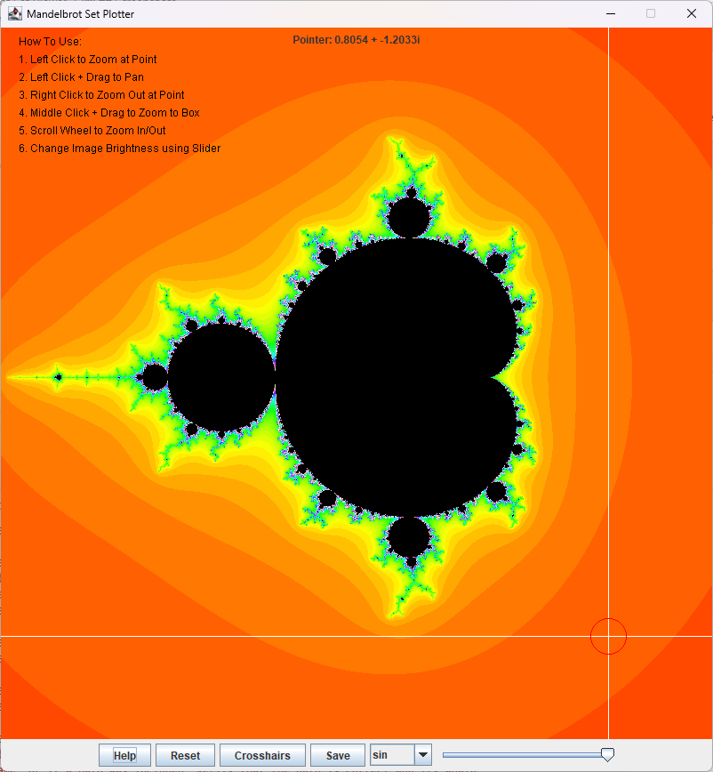
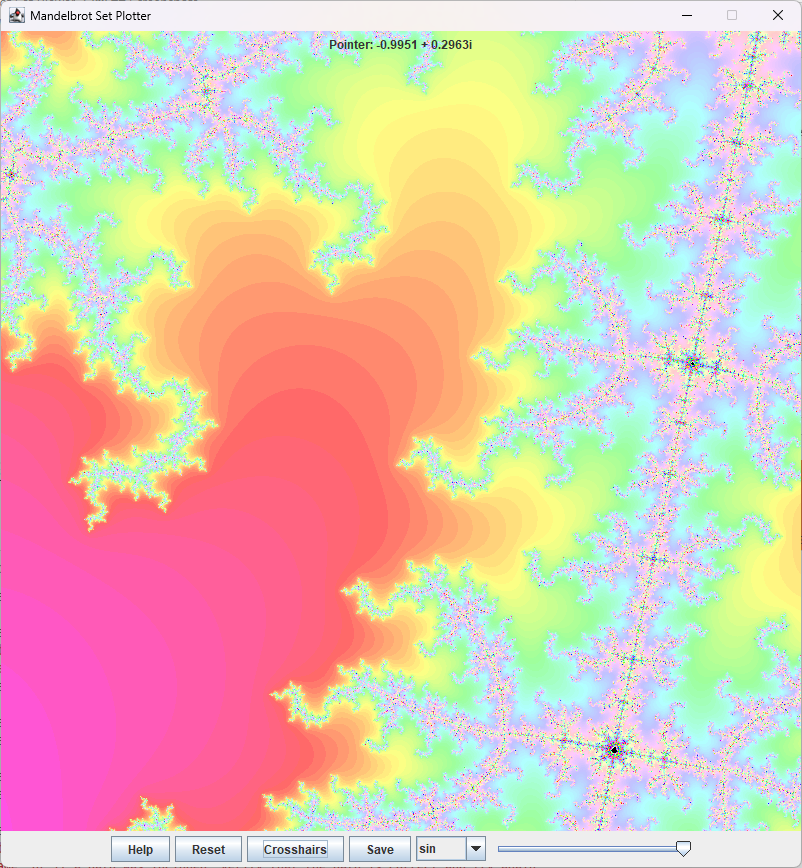

# Mandelbrot Set Viewer

View and Explore the Mandelbrot Set in a simple GUI.

## Directory Structure

```txt
JavaMandelbrotSetViewer/
 ├── src/
 │   ├── Fractal/
 │   │   └── Mandelbrot/
 │   │       ├── Image.java
 │   │       └── Panel.java
 │   │
 │   ├── util/
 │   │   ├── Complex.java
 │   │   ├── Vector2.java
 │   │   └── Vector3.java
 │   │
 │   └── App.java
 │
 ├── screenshots/
 │   └── *.png
 │
 ├── README.md
 ├── LICENSE
 └── .gitignore
```
## Usage

The following commands should be executed from the Project Root Directory

### Compiling


```sh
$ mkdir -p bin
$ cd src
$ javac App.java -d ../bin
```

### Running

```sh
$ java -cp './bin' 'App'
```

### Cleaning

```sh
$ rm -rf bin/
```

### Makefile

A Makefile has been provided with the above commands for ease of use.

```sh
$ make clean
$ make compile
$ make run
```

or alternatively,

```sh
$ make all
```

## Screenshots

